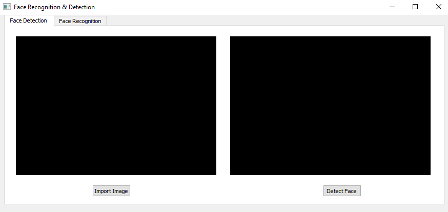
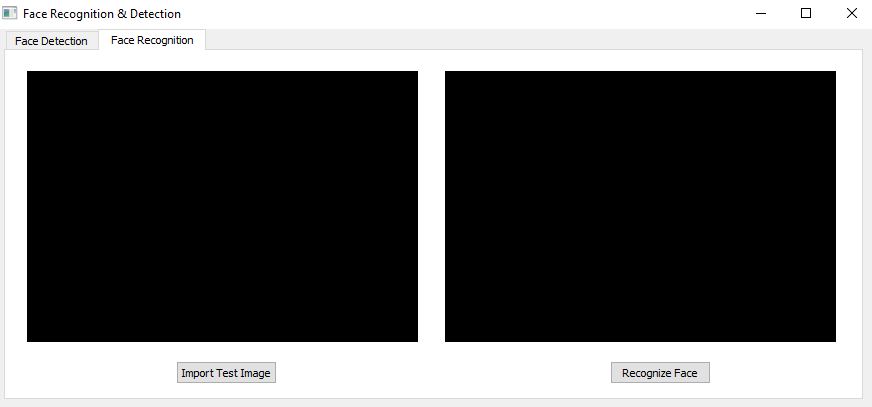
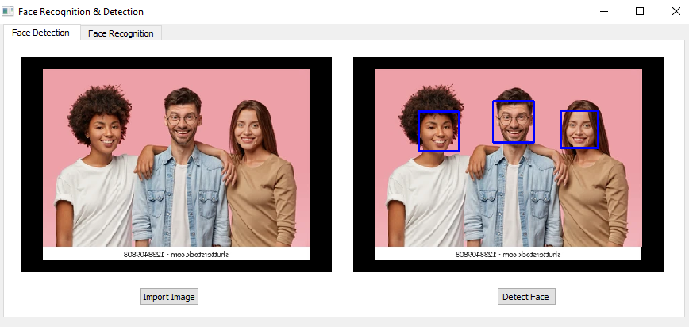
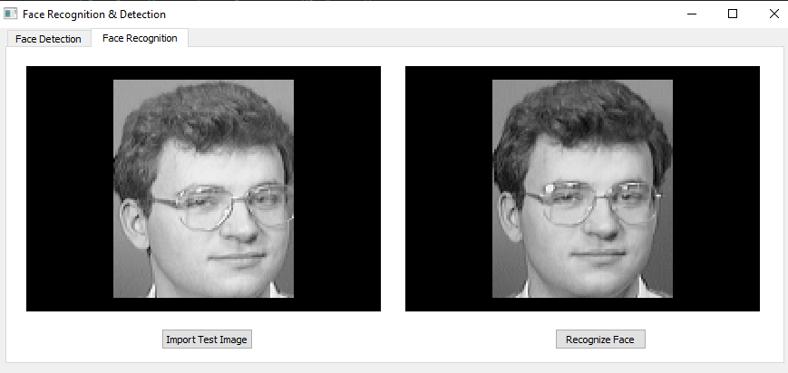
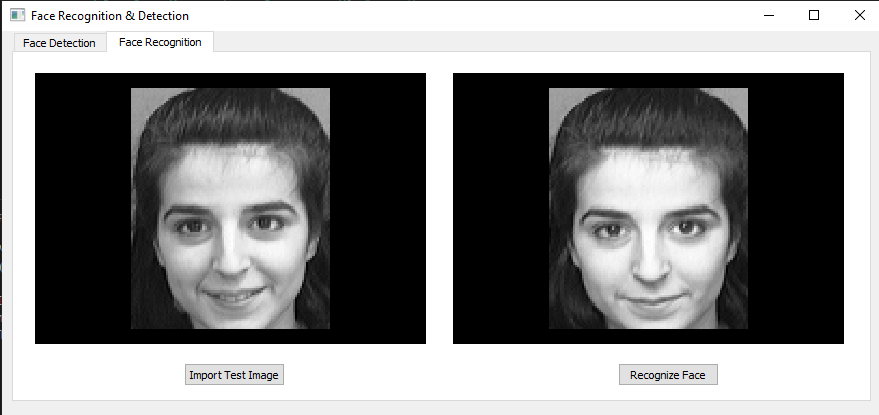
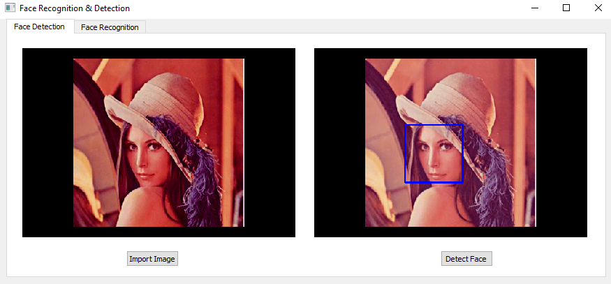
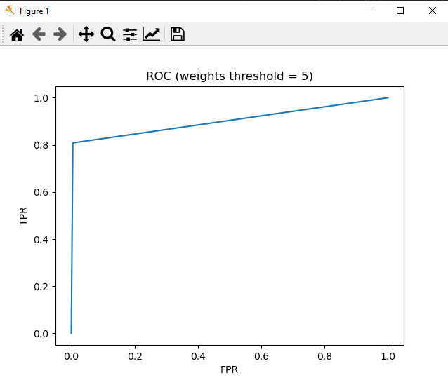
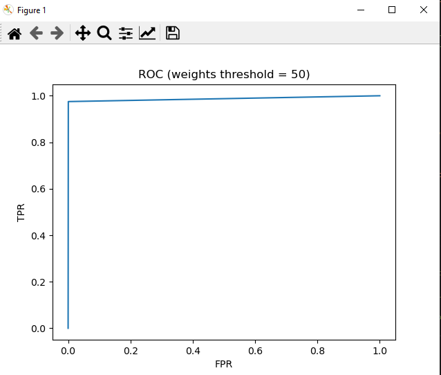

# Face-Recognition
* Implementation and testing of computer vision face recognition algorithms

* This project consists of :  

    1-**mainwindow.py**  : main UI window

    2-**main.py** : Pyqt GUI script  

    3- **EigenFaces.py** : implementation of face Recognition 

    4- **FaceDetection.py** : implementation of face Detection
------
  # Libraries Versions 

  - cv2 : version 4.5.5.64
  - matplotlib : version 3.3.4
  - scipy :  version 1.6.2
  - numpy :  version 1.22.2

  ------

# To open UI 

- First the UI consists of two tabs :

    - Face detection

  

  - Face Recognition:

   

- The result of face detectiom after applying image from "./image" folder :
  
   

- The result of face recognition after applying image from "./testset" folder :
  
   

- Another result from same folder :

   

# Main Contents

| Requiered Part | Title |
| ----------- | ----------- |
| [#Part 1](#part-1) | Face Detection |
| [#Part 2](#part-2) | Face Recognition |
| [#Part 3](#part-3) | ROC |

---

# Part 1

## Face Detection
We used Open-Cv to detect faces in images (grayscale or rgb),by unsing pre-trained cascaded classifier
Results:

---

# Part 2 

## Face Recognition

---
### introduction

The objective of this project is to highlight the importance of linear algebra in the field of computer vision and face recognition. Eigenface is the name of a set of eigenvectors computed from an image dataset. Eigenvectors is a set of features which characterize the global variation among face images.The basis of the eigenfaces method is the Principal Component Analysis (PCA).PCA is a dimensionality-reduction method that is often used to reduce the dimensionality of large data sets, by transforming a large set of variables into a smaller one that still contains most of the information in the large set.

### Algorithm

* first if all we Obtain face image and represent every image in a n^2 x m matrix Image.
* Compute the Mean face vector(m).
* Then subtract each image with mean.
* Compute the eigen vectors(v).
* Select eigenvectors(k).
* Now project new image into (k).
* The new image will be represented using the eigenvectors(x).
* Face Detection
    * Subtract x with m.
    * If the difference is lower than a chosen threshold, the new image face is detected.
* Face Recognitio.
    * Each image is represented using the eigenvectors.
    * Each image is then subtracted with x.
    * If the difference is lower than a chosen threshold, the new image face is classified to a class.

Mean image.

   

Each image when subtracted with the mean image.

  

Each image represented with eigenvectors.

  

---
# Part 3

## ROC
   
   
   
